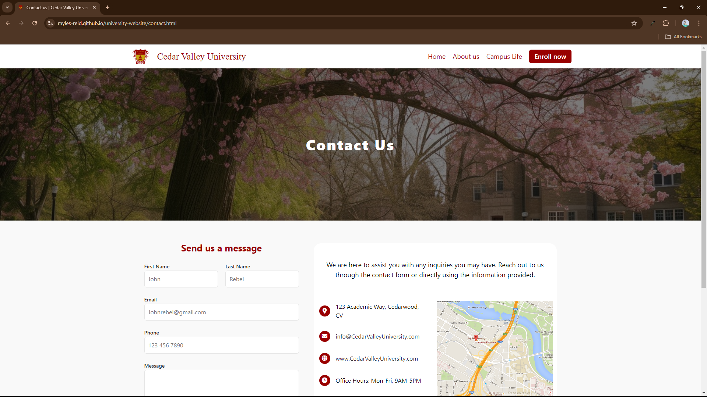

  

---

# Mock University Website

A simple three page website meant to imitate what a University or college would have 
as their own site. Nothing too fancy, there are some neat little CSS tricks to make 
things function without the use of JavaScript. 

---

## Authors

Thanks to the others that helped me on this, your input will not go unnoticed.

- [@mrshuaibu](https://github.com/mrshuaibu)
- [@SamuelReutcky](https://github.com/SamuelReutcky)
- [David Sommerville](https://github.com) 

---

### Screenshots

  
  
  

 

  
   

